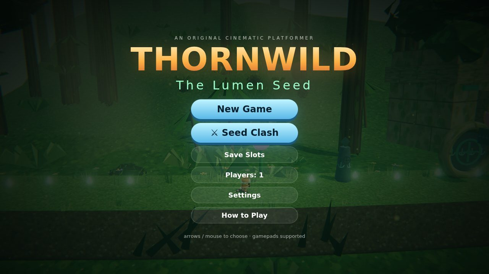
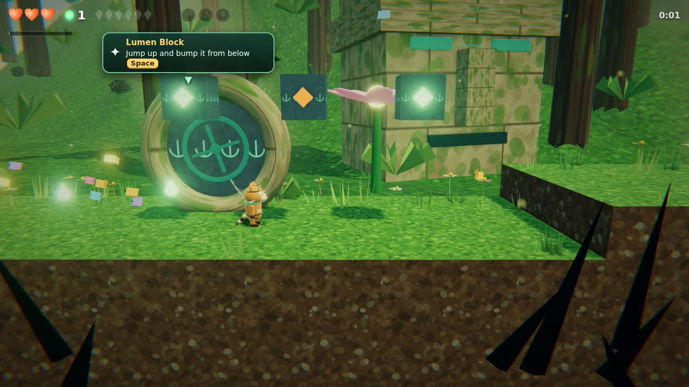
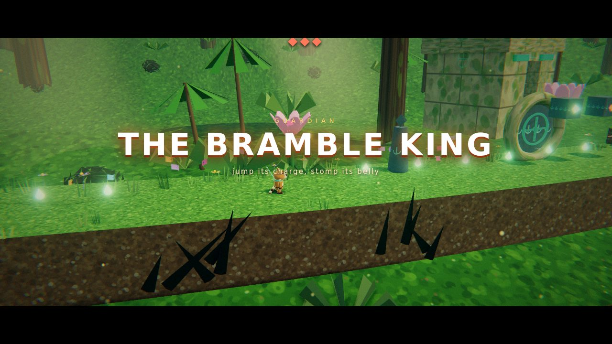
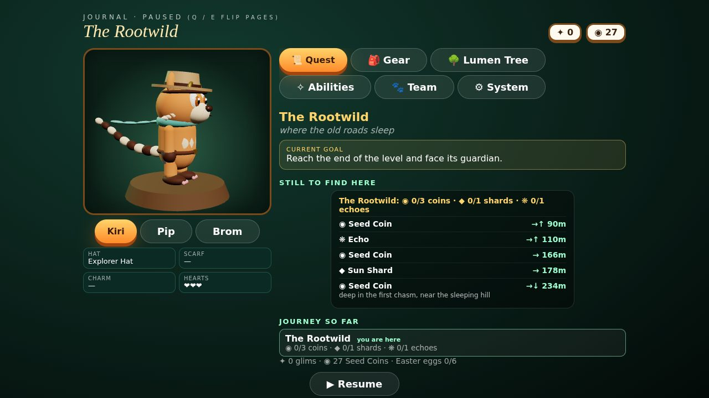
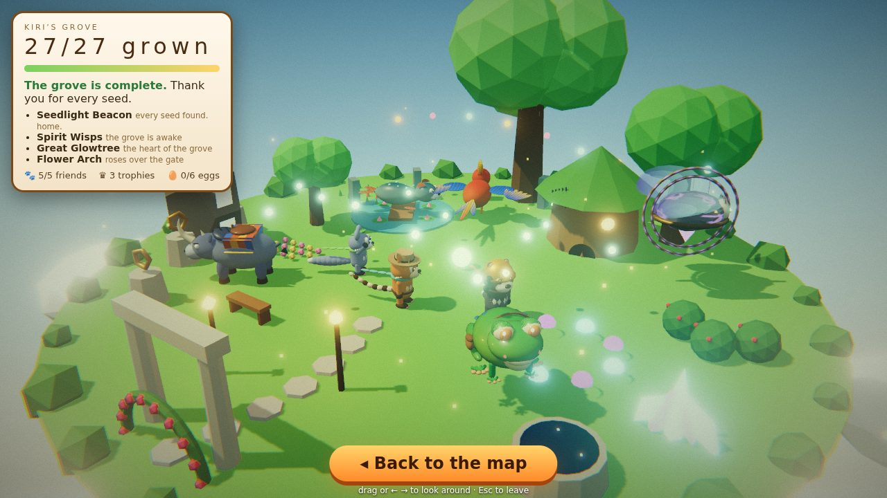
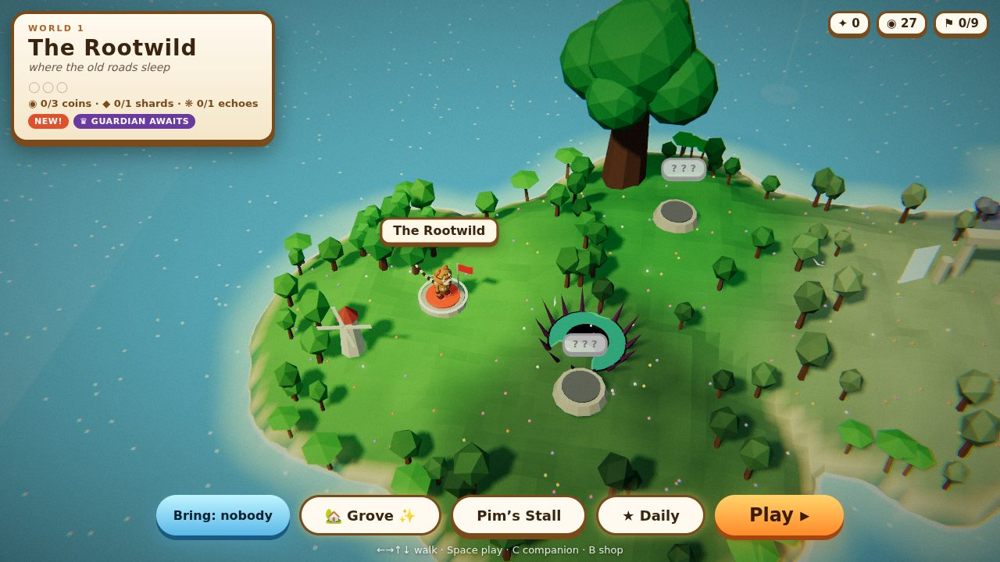
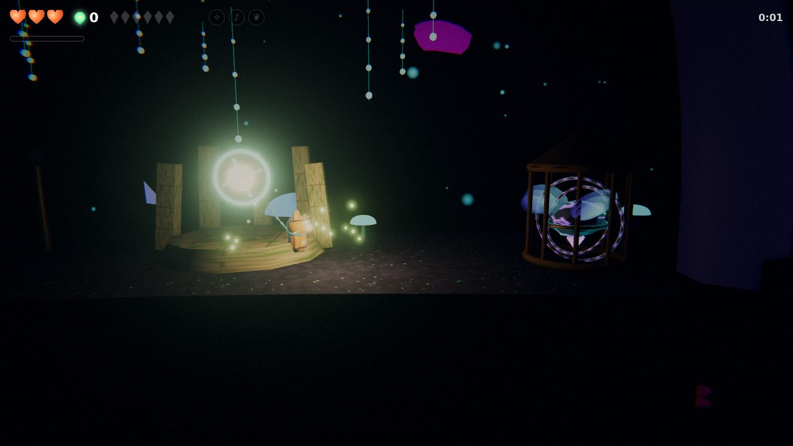

<div align="center">

# 🌿 THORNWILD · The Lumen Seed

**An original 2.5D cinematic platformer that runs in your browser.**
Run, wall-climb, dash and ground pound through living jungles, glowing caves and sky islands
with Kiri, Pip and Brom. Ride five wild companions, topple six giant guardians, and grow a home
of your own.

[**▶ Play in your browser**](https://mosrvs2025.github.io/donkeykong/) · [How to play](docs/HOW-TO-PLAY.md) · [What's new](CHANGELOG.md) · [Report a bug](../../issues/new/choose)



</div>

---

## ✨ Features

|  |  |
|---|---|
|  | **Nine worlds on one continent.** The Rootwild, the Canopy of Hands, the Weeping Ruins, the Glowdeep, the Sunwright Mine, the Heart of the Seed, plus hidden worlds: the Thornwell depths, the Sunken Sanctum and the Skyward Isles. |
|  | **Six guardians.** Each has a cinematic entrance, an enraged second phase with its own new attack, and a slow-motion finishing blow. |
|  | **A Zelda-style Journal.** Pause to see your quest and what's still hidden, equip outfits and charms, grow skills on the Lumen Tree, check abilities, swap heroes, and change settings. |
|  | **Kiri's Grove.** A home island that grows with you: every Seed Coin plants something new (27 in all), friends move in, and beaten guardians leave trophies. |
|  | **A living 3D world map.** It's a toy-box island with sailboats, gulls, a windmill and leaping fish. Drag, pinch and flick to explore it. |
|  | **Secrets everywhere.** Hero-only vaults under the road, cracked floors to pound through, Root Hollow mini-games, Echo Totems, and six Easter eggs we'll never tell you about. |

**Also inside:**
- 💥 **Combos and supers.** Chain stomps from NICE up to LEGENDARY, fill the Lumen meter, and unleash Kiri's *Sunburst*, Pip's *Acorn Storm* or Brom's *Earthquake*.
- ⚔️ **Seed Clash,** a local 4-player brawler with 10 fighters, each with its own special and team-up "bond" move.
- ★ **Daily challenge.** A new twist every day, and your streak grows as you keep it going.
- 👻 **Ghost races and time medals** for every level.
- 🎒 **Pim's Stall:** hats, scarves and charms with a 3D try-on preview.
- 🎵 **Music for every area** that speeds up for chases and bosses.
- 📱 **Plays anywhere:** keyboard, gamepad, or touch with a floating joystick.

## 🎮 Controls

| Action | Keyboard | Gamepad | Touch |
|---|---|---|---|
| Move | ← → / A D | left stick / d-pad | joystick (left thumb) |
| Jump (hold = higher) | Space / Z | A | ⤒ |
| Roll · companion ability | Shift / X | X / B | ⚡ |
| Ground pound | ↓ in mid-air | down in mid-air | joystick ↓ in mid-air |
| Sprout Dash | F / E + direction | bumpers | ➶ + joystick |
| Wall cling / climb | hold toward a wall | same | same |
| Swap hero | Q / Tab | Back / Select | ⇄ |
| Super (when the meter is full) | V | click a stick | ✸ |
| Hop off a companion | C | Y | ⏏ |
| Journal (pause) | Esc / P · flip pages Q E | Start · bumpers | ❚❚ |

More detail, tips and a guide to every hero and companion: **[How to play →](docs/HOW-TO-PLAY.md)**

## 🐾 The cast

**Heroes** (swap any time once they've joined)
- **Kiri:** a ring-tailed tinkerer and all-rounder. Wisp Leap, Rootgrip, the Lumen Song.
- **Pip:** small and quick. Glides, fires an acorn sling, swoops in mid-air, and fits through tiny tunnels.
- **Brom:** a badger miner. His rolls smash cracked walls and his ground pound becomes a Quake.

**Companions** (walk into a cage to free one and ride it)
Grumbo the Horned Beast · Boing the Tree Frog · Sola the Gliding Bird · Nuu the River Otter · Oru the Ancient.

## 🛠 For developers

```bash
npm install
npm run dev       # play locally with hot reload at http://localhost:5173
npm run build     # production build in dist/
npm run preview   # serve the build at http://localhost:4173
npm test          # automated gameplay checks (needs Playwright, see tests/README.md)
```

Built with **[Three.js](https://threejs.org/)** and **[Vite](https://vitejs.dev/)**. Every model, texture,
sound and song is generated in code: there are no asset files.

- [Architecture: which file does what](docs/ARCHITECTURE.md)
- [Level design: how levels, vaults and secrets are built](docs/LEVEL-DESIGN.md)
- Debug: open `?autostart&level=<id>` to jump straight into a level (`rootwild`, `canopy`, `ruins`, `glowdeep`, `mine`, `heart`, `thornwell`, `sunken`, `skyward`). The game object is exposed as `window.__game`.

**Deploying:** every push to the default branch builds the game and publishes it to GitHub Pages
(see `.github/workflows/pages.yml`). Vercel works too (`vercel.json`).

## 💬 Feedback

Found a bug or have an idea? [Open an issue](../../issues/new/choose). There are quick forms for both.

---

<sub>Thornwild is an original game. All characters, worlds and code are original creations.</sub>
